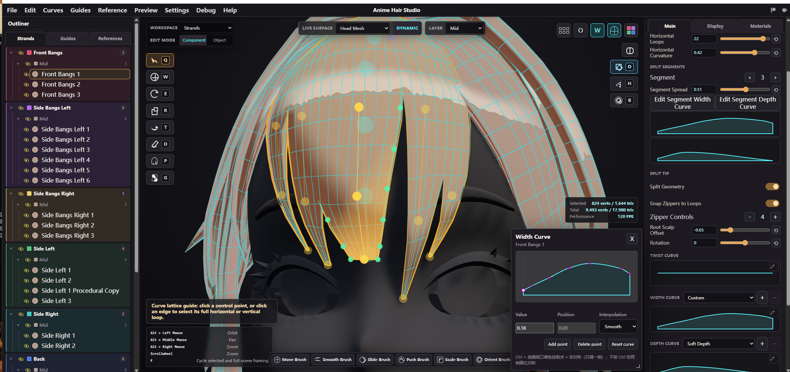
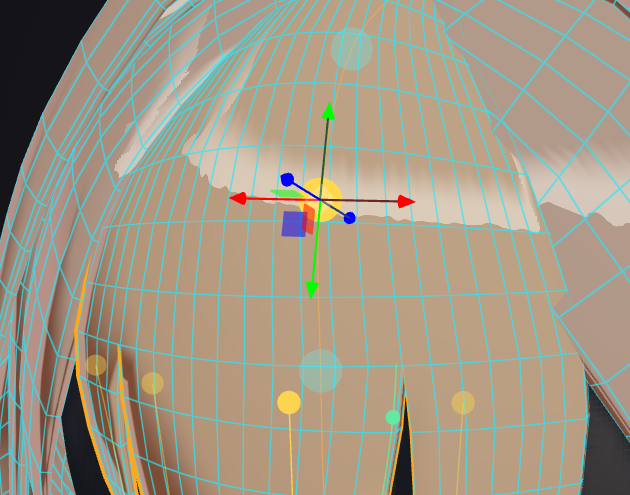
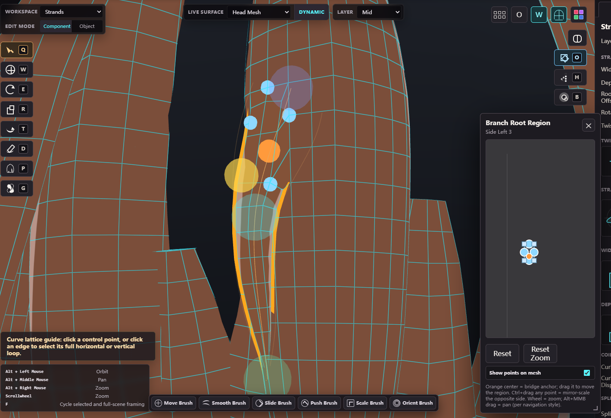

# Anime Hair Studio

[English](README_EN.md) | **中文（默认）**

**Anime Hair Studio** 是网页版动漫发片制作工具：在浏览器里直接绘制/雕刻 strand、braid、panel（3D 视口绘制/雕刻），支持头皮引导线、clump、材质、预设，以及 OBJ/USDA 导出。

本项目源自原作者 **Ludetools**（[github.com/Ludetools/Animehairstudio](https://github.com/Ludetools/Animehairstudio)），本仓库保留原作者 LICENSE 与捐赠链接；采用 source-available 许可，仅限个人/非商业用途。

## 本地部署（Python）

1. 安装 Python 3。
2. 在项目根目录运行：`python -m http.server 8080 --bind 127.0.0.1`。
3. 浏览器打开 `http://127.0.0.1:8080/`。
4. 或直接双击 `start-dev-server.cmd`（自动打开浏览器）。
5. 不要用 `file://` 直接打开 `index.html`（浏览器安全限制会阻止模块加载）。

或者（需要 Node.js）：内置静态服务器兼原生保存对话框代理 —— 项目根目录运行 `node server.js`，打开 `http://127.0.0.1:5173/`（改端口：`PORT=xxxx node server.js`，Windows PowerShell 用 `$env:PORT=xxxx; node server.js`）。也可以直接用 npm 通用静态代理 `npx http-server . -p 8080`。

## 本仓库新增功能（摘要）

- **简体中文 UI**（Settings → Language，3D 术语保留英文）
- **Panel Split 子骨骼 + 发尖子骨骼（tip sub-bone）**：每 split 段一个完整变换骨骼（P/orient/spread + 每段 Width/Depth 曲线）、视口 tip 链手柄/高亮/法线箭头、rotate/scale 挂 gizmo、发尖 WidthCurve（绿色控制点，左右独立、zipper 截断、Segment Spread 0–0.99、Reset 全 1）、每顶点蒙皮权重 [mainJoint, segment, weight] + USDA SkelBindingAPI 蒙皮
- **子发片**（低模水密桥接 + 父发片挖洞 + Region 选区 + 根骨骼 gizmo/twist/H 模式 + Bridge Smooth）
- **4 个自定义雕刻笔刷**（Slide / Scale·Cut-Extend / Push / Orient）+ Smooth twist；Ctrl=反向，例如 Scale 笔刷：默认放大，按住 Ctrl=缩小；Cut·Extend 模式默认延伸、Ctrl=裁剪
- **快速保存/导出优化**：Ctrl+S 快速保存（记住最近项目文件句柄）、Ctrl+Shift+S 另存为、Ctrl+Alt+S 快速导出复刻上次导出（优先 File System Access API 直接写盘，避免下载 (1) 后缀）
- File 菜单**移除**了 3 个 Local dev 选项（Local Save / Local Export to OBJ / Local Export to USDA，原走 server.js 本地服务），保存/导出统一为新增的三个快捷键（见下）。File 菜单**新增**三个保存/导出快捷键：Ctrl+S Quick Save、Ctrl+Shift+S Save as、Ctrl+Alt+S Quick Export；保存/导出优先用 File System Access API 直写盘（记住文件句柄、覆盖写同一文件、不再产生下载 (1) 后缀），浏览器不支持时回退下载/对话框。快捷键帮助有独立「Sintaka Fork」分区。
- **Houdini 导航（默认）**：Alt+左键旋转 / Alt+中键平移 / Alt+右键缩放 / 滚轮缩放
- **S+左键拖动调节笔刷大小**（含雕刻笔刷）；Delete 删除多余材质；Ctrl+Z 撤销修复（非文本输入控件可用）
- **拖放 .ahs/.animehair.json 直接打开项目**；浮动面板跟随选中
- **导出 UV 自动布局 + UV Checker 预览**：导出时按 `uvisland` 岛（每「主发片+子发片」family / panel 整片）统一纹素密度缩放后，用 alpaca 占位栅格 L 形扫描打包进 UDIM 1001（方形 bbox、无重叠、等比拉伸不 normalize、不旋转），USDA 输出 `primvars:uvisland`；**UV Checker 窗口顶部 ⟳ 按钮**按一下走同一导出展开流程，在视口棋盘格 + 2D UV Inspector 里预览最终打包布局，不用导入 DCC 确认

## 发尖子骨骼（tip sub-bone）

每个 split 段有独立发尖子骨骼；视口选中后显示发尖链手柄/高亮/法线箭头。绿色控制点是该段发尖的 WidthCurve，只影响当前发尖宽度，zipper 上半部分跟随主骨骼（不裂）；Segment Spread 控制尖端聚合 0–0.99（防退化面）；蒙皮权重按两侧 zipper 顶斜线分界，scale 笔刷不会把低 zipper 侧拉裂；旋转（E）/缩放（R）工具下挂变换 gizmo。

快捷键提示：

- **Alt + 左键**：快速切换选中到悬停的发尖子骨骼段（或悬停的发丝），不用先取消当前选中。——操作习惯与 Zbrush 相同（Alt+点击拾取/快速切换悬停目标）
- **Ctrl + 左键拖动**（发尖绿色 WidthCurve 控制点）：非对称编辑——只调被拖的一侧；不加 Ctrl 默认等比镜像两侧。
- **Ctrl + 左键拖动**（其它地方）：特殊/反转功能——雕刻笔刷反向（Ctrl=反向，例如 Scale 笔刷：默认放大，按住 Ctrl=缩小；Cut·Extend 模式默认延伸、Ctrl=裁剪）、选择工具 Ctrl+左键从选中移除。
- **快速保存优化**：Ctrl+S 快速保存到最近一次的项目文件（记住文件句柄，覆盖写同一文件）；Ctrl+Shift+S 另存为；Ctrl+Alt+S 快速导出复刻上次导出。
- **其它自定义快捷键**：S+左键拖动调笔刷大小、Houdini 导航（Alt+左/中/右键）、Delete 删多余材质、H 层级编辑（根骨骼工作流）、Ctrl+Z 撤销（含非文本输入控件）。

## 坐标系与 gizmo 向量

应用使用 Three.js 右手坐标系；曲线/发尖子骨骼 gizmo 使用随链方向变化的**局部坐标系**。

三个重要向量（颜色对应截图）：**绿色 = 切线（Tangent，Y）**——沿发尖链/曲线方向；**红色 = 副切线（Bitangent，X）**——横向/宽度方向；**蓝色 = 法线（Normal，Z）**——垂直面板/曲线表面。宽度拖拽、旋转轴向、法线箭头都基于这套局部坐标系。

## 雕刻笔刷

四个自定义雕刻笔刷说明：

- **Slide（滑动）**：沿曲线轨迹（切线方向）移动控制点，限制在切线/法线平面内滑动，不改变曲线长度比例。
- **Push（推）**：沿局部上方向（法线/垂直表面）推离表面，限制为法线方向移动。
- **Orient（定向）**：绕切线旋转截面，把截面的法线（上方向）转向视口正交方向（改变切线旋转）。
- **Scale（缩放）**：两种模式——**Scale**：以根部为锚点整发片等比缩放（径向、非移动）；**Cut·Extend（裁剪/延伸）**：整发片均匀参数缩放，保持点间距（factor<1 裁剪、factor>1 沿末端切线延伸）。

Ctrl=反向说明：所有笔刷按住 Ctrl 为反向——Scale 笔刷默认放大、Ctrl 缩小；Cut·Extend 默认延伸、Ctrl 裁剪。

## 子发片（低模水密桥接）

父发片被挖洞打开，子发片通过低模水密桥接（父洞边界 → 子发片根环 → 顶/底带 + 侧边四边形）连接；父表面 Region 选区（2D u/v 面板 + 3D 标记）、直接/间接桥接、均匀平滑（Strength/Detail）；子发片根骨骼工作流（gizmo 携带 twist、H 层级刚性移动、Region 锚定中心）；父发片不使用拓扑连接（如 Split Geometry）时回退直接生成（从根部扫掠）；**UV 布局已解决**（导出时展开 + 按岛打包进 UDIM 1001，见上「导出 UV 自动布局」）。

## 导出 UV 布局（拆 UV）

导出（OBJ/USDA）时按扫掠网格的 `gridRow/gridCol` 属性生成矩形 UV（V 负方向 = 发丝切线，头发竖直向下打直），再把每个「主发片 + 子发片 / panel 整片」作为岛（`uvisland` 岛编号）统一纹素密度缩放后，用 **alpaca 占位栅格 L 形扫描** 打包进 UDIM 1001（[0,1]²）：

- **算法**：tile 栅格化（256 格/单位 UV）+ 积分图 O(1) 判空；`scanLine` 逐岛增长维持「方形边界」，两阶段放置（先沿「顶边 + 右边」L 形扫描填内部空隙、再无空位才外扩边界）；打包后整包等比缩放 + 居中（fit-to-tile：保持宽高比、不 normalize、不旋转）。
- **多起点择优**：8 个确定性随机序各跑一遍取最优（比单次贪心填充率约 +7%）。
- **效果**：panel 与普通发丝混排、整包近似方形（U/V 双侧≈填满）、无重叠无兜底、填充率约 0.76~0.81。
- **预览**：UV Checker 窗口顶部 ⟳ 按钮走同一导出流程，在视口棋盘格 + 2D UV Inspector 里预览最终布局，无需导入 DCC。

参考文献：

- Nöll, T., Stricker, D. (2011). *Efficient Packing of Arbitrary Shaped Charts for Automatic Texture Atlas Generation*. Eurographics. <https://www.semanticscholar.org/paper/Efficient-Packing-of-Arbitrary-Shaped-Charts-for-N%C3%B6ll-Stricker/643267eb8be94784f005a48c9ce1bdb716d1008f>
- TABI (2026). *Tight and Balanced Interactive Atlas Packing*. UBC/NVIDIA. <https://www.cs.ubc.ca/labs/imager/tr/2026/tabi/>
- Jylänki, J. *A Thousand Ways to Pack the Bin — A Practical Approach to Two-Dimensional Rectangle Bin Packing*. <http://clb.demon.fi/projects/more-rectangle-bin-packing>
- jpcy/xatlas — UV atlas library. <https://github.com/jpcy/xatlas>

## 已知限制

- **UV**：导出 UV 已展开并打包进 UDIM 1001；当前打包器为贪心（alpaca 占位栅格 L 形扫描 + 多起点 seed 择优），填充率约 0.76~0.81，不旋转（保持发丝各向异性方向）；hairCard / curve-surface 等其它 open/compound 类型本轮不纳入打包。
- **导出**：目前 USDA 导出以 NURBS 曲线（BasisCurves）为主，**尚未输出完整的 USD 骨骼（Skeleton/SkelBindingAPI 蒙皮绑定）**——骨骼/蒙皮数据暂未作为可用骨架导出。

## 开发文档

- 新 agent 入门：[devlog/AGENT_QUICKSTART.md](devlog/AGENT_QUICKSTART.md)
- 完整 devlog 索引：[devlog/README.md](devlog/README.md)

## 许可说明

source-available（非 OSI 开源）许可：仅限个人/非商业用途；再分发须附带 LICENSE，并保留作者捐赠链接。
