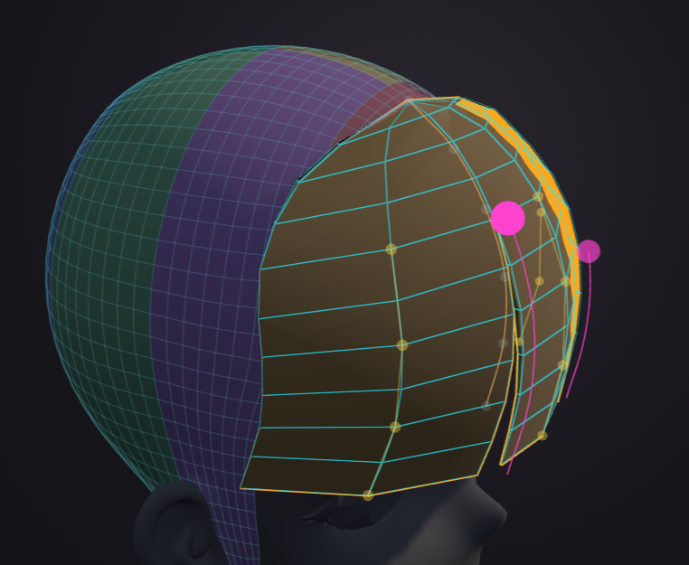
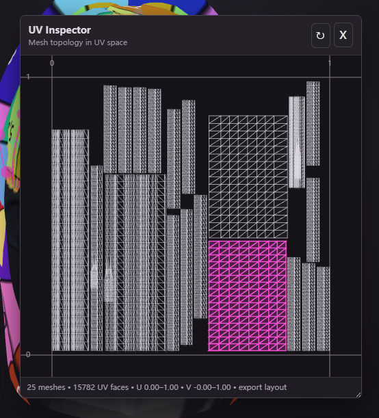

# Anime Hair Studio

[English](README_EN.md) | **中文（默认）**

**Anime Hair Studio** 是网页版动漫发片制作工具：在浏览器里直接绘制/雕刻 strand、braid、panel（3D 视口绘制/雕刻），支持头皮引导线、clump、材质、预设，以及 OBJ/USDA 导出。

本项目源自原作者 **Ludetools**（[github.com/Ludetools/Animehairstudio](https://github.com/Ludetools/Animehairstudio)），本仓库保留原作者 LICENSE 与捐赠链接；采用 source-available 许可，仅限个人/非商业用途。

## 使用本仓库的代码

本仓库是原项目的本地适配版。我的改动通常在 **dev 分支**上（不是 `main`）。无论是 merge 分支还是在此基础上做二次开发，都可以直接使用，**无需额外授权**；我会持续改进这个项目，让它更贴合 Houdini 工作流。

## 本地部署（Python）

1. 安装 Python 3，在项目根目录运行 `python -m http.server 8080 --bind 127.0.0.1`，浏览器打开 `http://127.0.0.1:8080/`。
2. 或直接双击 `start-dev-server.cmd`（自动打开浏览器）。
3. 不要用 `file://` 直接打开 `index.html`（浏览器安全限制会阻止模块加载）。

或者（需要 Node.js）：内置静态服务器兼原生保存对话框代理 —— 项目根目录运行 `node server.js`，打开 `http://127.0.0.1:5173/`（改端口：`PORT=xxxx node server.js`，Windows PowerShell 用 `$env:PORT=xxxx; node server.js`）。也可以用 npm 通用静态代理 `npx http-server . -p 8080`。

## 本仓库新增功能（摘要）

### 发尖系统

- **Tip Clump（发尖收窄，0.2.132 起 panel/strand 统一语义）**：拖滑杆（或视口绿色小球）让发尖按自身宽度收窄，从 zipper 处 0 线性收到发尖满值；配合 zipper 即可分叉——zipper 定缝、Tip Clump 收拢发尖使缝张开，绿色宽度控制点随之联动。旧 Split Spacing 滑杆（职责与 zipper 重叠）已删除，旧值转为各管 Tip Clump 初值。
- **Panel Split 子骨骼 + 发尖子骨骼**：每 split 段一个完整变换骨骼（P/orient/Tip Clump + 每段 Width/Depth 曲线）、tip 链手柄/高亮/法线箭头、rotate/scale 挂 gizmo、发尖 WidthCurve（左右独立、zipper 截断、Tip Clump 0–0.99、Reset 全 1）、每顶点蒙皮权重 + USDA SkelBindingAPI 蒙皮。
- **普通 strand 子发尖可选中、可控制（0.2.126）**：对齐 panel——点选中/再点退回、划过高亮、每链点都有把手、旋转显示法线箭头、W/E/R 挂 gizmo、笔刷只雕选中管、alt+点快切、切换自动清理；段号与选中态独立。同期还有 Split Segments 段选择器 + 每管 Tip Clump（原 Segment Spread）+ Width/Depth Curve 编辑（0.2.125，仅 Split Geometry 开启时出现），以及发尖 WidthCurve 移植到普通 strand：每管在自己 zipper 以上用自己曲线、以下跟随全局曲线（切换处连续），两侧共用同一参数网格，暴露点数随各自 zipper 高度变化，只缩放发尖不影响 UV。
- **历次 tip/zipper 修复**：panel 发尖 gizmo 跳位（0.2.126，rest 链动过后一按 W/E 就跳，与 0.2.120 笔刷跳位同根因）、多管第 3 根起无发尖手柄、镜像后姿态贴错管且 zipper 未重排序、两侧高度不同时浅侧一个控制点抓不到——均已修复；每个 zipper 高度多暴露一根发尖骨骼，骨骼根锚在第一个暴露点之下；笔刷雕刻发尖不再跳回原位。

### 子发片与桥接

- **子发片**（低模水密桥接 + 父发片挖洞 + Region 选区 + 根骨骼 gizmo/twist/H 模式 + Bridge Smooth）。

### 几何与形变

- **普通 strand 支持多个 zipper**：从单 zipper 升级为多 zipper（N 个 zipper → N+1 根管），strand 面板新增 +/− Zipper Controls（最多 8 个），编辑体验详见下方「zipper（拉链）编辑」章节；几何、UV 展开、骨骼与 USDA 导出全部跟随，旧的单 zipper 存档照常打开。

### UV 与导出

- **导出 UV 自动布局 + UV Checker 预览**：导出时按 `uvisland` 岛统一纹素密度缩放后打包进 UDIM 1001，UV Checker 窗口可预览最终布局，详见下方「导出 UV 布局」章节。
- **USDA 骨骼 / 蒙皮导出**：完整 USD Skeleton + SkelBindingAPI 蒙皮绑定，可直接在 Houdini 里 USD Character Import，详见下方「USDA 骨骼 / 蒙皮导出」章节。

### UI 与交互

- **简体中文 UI**（Settings → Language，3D 术语保留英文）；**5 个自定义雕刻笔刷**（Slide / Scale·Cut-Extend / Push / Orient / Twist）+ Smooth twist，详见「雕刻笔刷」章节；笔刷选区遮罩——未选中任何头发时只雕刻可见头发，有选中时只雕刻选中的头发。
- **快速保存/导出优化**：Ctrl+S 快速保存（记住最近项目文件句柄）、Ctrl+Shift+S 另存为、Ctrl+Alt+S 快速导出复刻上次导出（优先 File System Access API 直接写盘，避免下载 (1) 后缀）；File 菜单移除了原走 server.js 的 3 个 Local dev 选项，帮助里独立「Sintaka Fork」分区。
- **视口导航风格**：Anime Hair Studio（默认）/ Blender / Houdini 三种，在 Settings → Preferences → Navigation style 切换；S+左键拖动调笔刷大小；Delete 删多余材质；Ctrl+Z 撤销修复（非文本输入控件可用）；拖放 .ahs/.animehair.json 直接打开项目；浮动面板跟随选中。
- **Wind Preview（吹风预览）**：Preview 菜单打开浮动窗口，10 个参数（风向/强度/频率/湍流/阵风/根部指数/随机度/seed 等）实时预览头发被风吹动的形态，发根不动、尖部摆幅最大；关闭窗口即逐位恢复原状，不写入存档。

## 雕刻笔刷

五个自定义雕刻笔刷说明：

- **Slide（滑动）**：沿曲线切线方向移动控制点，限制在切线/法线平面内，不改变曲线长度比例。
- **Push（推）**：沿局部法线方向推离表面，限制为法线方向移动。
- **Orient（定向）**：绕切线旋转截面，把截面法线转向视口正交方向。
- **Scale（缩放）**：两种模式——**Scale**：以根部为锚点整发片等比缩放（径向、非移动）；**Cut·Extend（裁剪/延伸）**：整发片均匀参数缩放，保持点间距（factor<1 裁剪、factor>1 沿末端切线延伸）。
- **Twist（扭转）**：绕切线轴手动滚转，只改朝向不移动点（详见下节）。

Ctrl=反向：所有笔刷按住 Ctrl 为反向——Scale 默认放大、Ctrl 缩小；Cut·Extend 默认延伸、Ctrl 裁剪。

### Twist

手动轴向滚转笔刷：按住左键左右拖动，笔刷范围内的 strand 绕自己的切线方向滚转，用来手工调整发片朝向/翻面，不改变形状。

- **方向与相机无关**：角度只取自水平拖动量，拖右/拖左是相反方向，Ctrl 再反向。这是它与 Orient 的本质区别——Orient 把截面法线转向当前视口方向，环绕视角后同样拖动会翻方向；Twist 不会。
- **只转朝向、绝不移动点**：几何位置全程不变，只有扫掠截面的滚转角在变。
- **H（Hierarchy）模式**：滚转传播到下游子骨骼，但子骨骼**位置钉死不动**，整条子链只做刚性滚转（区别于普通层级旋转会带着位置一起绕 pivot 转）。
- **按下即锁定影响范围**：唯一一个在起笔时冻结影响点集的笔刷——按下左键那一刻就确定哪些点受影响、权重多少，之后拖动不再改变范围，直到松开左键。其它笔刷都实时跟随光标。

**没有为 Twist 分配快捷键**，只能从左侧工具栏的笔刷按钮进入。

## 发尖子骨骼（tip sub-bone）

每个 split 段有独立发尖子骨骼；视口选中后显示发尖链手柄/高亮/法线箭头。绿色控制点是该段发尖的 WidthCurve，只影响当前发尖宽度，zipper 上半部分跟随主骨骼（不裂）；Segment Spread 控制尖端聚合 0–0.99（防退化面）；蒙皮权重按两侧 zipper 顶斜线分界，scale 笔刷不会把低 zipper 侧拉裂；旋转（E）/缩放（R）工具下挂变换 gizmo。

两侧 zipper 高度不同时，绿色控制点共用同一套参数位置（间距一致），但各侧只暴露落在自己 zipper 以下的那些——深的一侧多、浅的一侧少，随高度动态变化；看得见的点一定能抓、也一定作用于该侧宽度（旧版本浅侧曾漏掉一个点导致宽度凹陷，已修复）。

## zipper（拉链）编辑

panel 和普通 strand 都支持多个 zipper：**N 个 zipper 会把发片切成 N+1 根管**。在对应面板的 Zipper Controls 用 `+` / `−` 增删（strand 最多 8 个），每个 zipper 有自己的位置与高度，可以在视口里直接拖动手柄调整。

- `+` 优先细分当前选中的那一段，深度跟随被切开那一段旁边的 zipper（0.2.125 起，此前恒取最左那条的高度）；新切出来的两段都继承原来那段的发尖姿态，不会跳回默认值。
- `−` 删除最近添加的那个 zipper（不是位置最右的那个），所以精心拖好的 zipper 不会被误删；删除后合并出来的大发尖也保持接近原姿态。
- 点击 zipper 手柄可以选中它（手柄放大提亮），按 **Del** 只删这一个 zipper；没有选中 zipper 时 Del 才删整根头发。拖动手柄本身不会删除任何东西。
- 每个 zipper 高度会多暴露一根发尖骨骼，骨骼根始终锚在它第一个暴露点之下，视口显示与 USDA 导出对「哪几行被暴露」的判断一致；几何、UV 展开、骨骼与 USDA 导出都会跟着多 zipper 走，旧的单 zipper 存档可以照常打开，行为不变。

## Scalp Conform（贴合头皮 / 纬线轴 + 拟合椭球）

一整片前刘海裹在头皮半球上：绿/紫是头皮代理网格，青色行线是 panel 被弯到拟合椭球的纬线上之后的走向——每一行绕的都是**竖直**轴，所以边缘顺着头皮往后扫，而不是朝头顶卷。

把平的 panel 发片沿头皮弯过去，**严格保弧长**——发片不会被压窄，宽度是它原本的宽度。主要用途是**前额的动漫三叉刘海做成一整片**：拉宽 width、给一点 Conform，整片就顺着头皮往后包住额头与两侧鬓角，再用 zipper 切出三叉分缝，不必手工去调边缘曲线、也不必拼三片各自摆位。

### 数学模型

弯曲**不绕发片自己的切线转**（那会让前额倾斜段的边缘被卷进头皮），而是逐行从一个**拟合椭球**上推出弯曲轴：

- 用水平面切椭球，得到该行所在的**纬线椭圆**：半轴 `A = ax·c`、`B = az·c`，其中 `c = √(1 − h²)`、`h = (P.y − 头心.y) / ay`。**纬线圆心随高度上移、恒留在水平横切面内**（往北极偏移）。
- 取该方位角上纬线椭圆的**密切圆心** `O_osc`，过它作**竖直**弯曲轴；`Reff = |P − O_osc|`、曲率 `k = amount / (Reff + gap)`。
- 轴恒竖直 ⇒ 顶点只在水平面内移动 ⇒ 边缘**往后扫**而不是往下卷，长发因此仍能直垂。
- 保弧长靠**离散逐段保长**（逐段只转方向、不改长度），所以偏离中性面的部分也不被缩放。

椭球退化成球时，密切圆心精确回到纬线圆心（圆的密切圆心即圆心），所以**默认头模下与上一版本逐位相同**。

### 控制选项

| 控件 | 范围 | 作用 |
|---|---|---|
| **Conform** | −1 … 1 | 贴合强度。0 = 完全不弯（与平板逐位相同）、1 = 完整卷到 `Reff + gap` 的弧上、负值朝反面卷。**逐发片**。 |
| **Scalp Gap** | 0 … 0.5 | 弯曲半径的外扩量（世界单位）。既防 z-fighting，也是「包松/包紧」的旋钮。**逐发片**。 |
| **Fit Width** | 0.5 … 1.5 | 拟合椭球的**左右**半轴。**全局**（所有 panel 共用）。 |
| **Fit Depth** | 0.5 … 1.5 | 拟合椭球的**前后**半轴。**全局**。 |

Fit Width / Fit Depth 与可视头皮代理的尺寸滑杆**刻意分开**：可视头皮还叠了 lattice 与分段整形，最佳拟合椭球本来就不等于那几个滑杆的值，分开调才能真的把近似调准。椭球只是**近似模型**，不追求贴合被 lattice 变形后的真实头皮网格。

### 已知限制

- 球构型（Fit Width == Fit Depth）下**头的整体尺寸与高度不影响** conform——圆的密切圆心与半径无关，代数上被消掉。要调包裹松紧用 Scalp Gap，要调竖轴位置用头皮代理的 Center X/Z。
- **非球构型**（Fit Width ≠ Fit Depth）下「边缘不扎进头皮」不再由构造保证（椭圆其它方位角的水平半径可能大于 `Reff`）；且正面与侧面的包裹松紧会不一致，方向随两个半轴的相对大小翻转。球构型不受影响。
- Conform 拉到 **1.0** 时含 camber 的发片边缘会轻微穿透头皮，实用区间 **≤ 0.87**。
- lattice 控制的 surface 面板不参与（形状由控制网格直接决定）。

## 快捷键提示

- **Alt + 左键**：快速切换选中到悬停的发尖子骨骼段（或悬停的发丝），不用先取消当前选中——操作习惯与 Zbrush 相同。
- **Ctrl + 左键拖动**：发尖绿色 WidthCurve 控制点上为非对称编辑（只调被拖的一侧，不加 Ctrl 默认等比镜像两侧）；其它地方为雕刻笔刷反向（Scale 默认放大、Ctrl=缩小；Cut·Extend 默认延伸、Ctrl=裁剪）、选择工具从选中移除。
- **保存/导出**：Ctrl+S 快速保存到最近一次的项目文件（记住文件句柄，覆盖写同一文件）；Ctrl+Shift+S 另存为；Ctrl+Alt+S 快速导出复刻上次导出。
- **Del**：选中 zipper 时只删该 zipper；材质面板聚焦时删除该材质；否则删除当前选中的头发。
- **其它自定义快捷键**：S+左键拖动调笔刷大小、Delete 删多余材质、H 层级编辑（根骨骼工作流）、Ctrl+Z 撤销（含非文本输入控件）。
- **视口导航**：默认 Anime Hair Studio 风格（Alt+左键旋转 / Alt+右键平移 / 滚轮缩放）；Houdini 风格为 Alt+左键旋转 / Alt+中键平移 / Alt+右键缩放 / 滚轮缩放，在 Settings → Preferences → Navigation style 切换。完整列表见应用内 Help → Shortcuts（本仓库新增项在「Sintaka Fork」分区）。

## 坐标系与 gizmo 向量

应用使用 Three.js 右手坐标系；曲线/发尖子骨骼 gizmo 使用随链方向变化的**局部坐标系**：

三个重要向量（颜色对应截图）：**绿色 = 切线（Tangent，Y）**沿发尖链/曲线方向；**红色 = 副切线（Bitangent，X）**横向/宽度方向；**蓝色 = 法线（Normal，Z）**垂直面板/曲线表面。宽度拖拽、旋转轴向、法线箭头都基于这套局部坐标系。

## 子发片（低模水密桥接）

父发片被挖洞打开，子发片通过低模水密桥接（父洞边界 → 子发片根环 → 顶/底带 + 侧边四边形）连接；父表面 Region 选区（2D u/v 面板 + 3D 标记）、直接/间接桥接、均匀平滑（Strength/Detail）；子发片根骨骼工作流（gizmo 携带 twist、H 层级刚性移动、Region 锚定中心）；父发片不使用拓扑连接（如 Split Geometry）时回退直接生成。UV 布局已解决（导出时展开 + 按岛打包进 UDIM 1001，见下「导出 UV 布局」）。

## 导出 UV 布局（拆 UV）

导出（OBJ/USDA）时按扫掠网格的 `gridRow/gridCol` 属性生成矩形 UV（V 负方向 = 发丝切线，头发竖直向下打直），再把每个「主发片 + 子发片 / panel 整片」作为岛（`uvisland` 岛编号）统一纹素密度缩放后，用 **alpaca 占位栅格 L 形扫描** 打包进 UDIM 1001（[0,1]²）：

- **算法**：tile 栅格化（256 格/单位 UV）+ 积分图 O(1) 判空；`scanLine` 逐岛增长维持方形边界，两阶段放置（先 L 形扫描填内部空隙、再无空位才外扩边界）；打包后整包等比缩放 + 居中（不 normalize、不旋转）。8 个确定性随机序取最优（比单次贪心约 +7%），结果是 panel 与普通发丝混排、整包近似方形、无重叠无兜底，填充率约 0.76~0.81。
- **预览与速度**：UV Checker 窗口顶部 ⟳ 按钮走同一流程，在视口棋盘格 + 2D UV Inspector 里预览，无需导入 DCC；打包已多线程化（Worker 池），大工程导出明显更快，浏览器不支持 Worker 时自动回退单线程，结果一致。

参考文献：

- Nöll, T., Stricker, D. (2011). *Efficient Packing of Arbitrary Shaped Charts for Automatic Texture Atlas Generation*. Eurographics. <https://www.semanticscholar.org/paper/Efficient-Packing-of-Arbitrary-Shaped-Charts-for-N%C3%B6ll-Stricker/643267eb8be94784f005a48c9ce1bdb716d1008f>
- TABI (2026). *Tight and Balanced Interactive Atlas Packing*. UBC/NVIDIA. <https://www.cs.ubc.ca/labs/imager/tr/2026/tabi/>
- Jylänki, J. *A Thousand Ways to Pack the Bin — A Practical Approach to Two-Dimensional Rectangle Bin Packing*. <http://clb.demon.fi/projects/more-rectangle-bin-packing>
- jpcy/xatlas — UV atlas library. <https://github.com/jpcy/xatlas>

## USDA 骨骼 / 蒙皮导出

导出 USDA 时勾选 **Bones & Capture Mesh**（默认勾选），输出的是可直接使用的完整 USD 骨架：

- 单个 `def SkelRoot "Character"`，内含一个 `def Skeleton "Hair_Skel"` 与所有蒙皮 mesh，在 Houdini 里 `USD Character Import` 填一个 `skelrootpath` 就能一次导入整个角色；一个 `Hair_Root` 空关节作为唯一骨骼根（x=0 正中线、位置取所有发根平均），所有发丝的根关节挂在它下面构成单一连通骨骼树，关节以**发丝名**为前缀命名（`${发丝名}_${序号}` / `_split_${k}` / `_split_${k}_tip_${j}`），同名发丝自动去重。
- Mesh 施加 `SkelBindingAPI`：`rel skel:skeleton` + `int[] primvars:skel:jointIndices` / `float[] primvars:skel:jointWeights`（带 `elementSize`）；panel 段为双影响、普通发丝为单影响、桥接子发片 family 为 4 影响 capture。同时输出 `int[] primvars:uvisland`（每面一个岛编号，DCC 里可按 `@uvisland==k` 选岛）。
- 菜单另有 Path Prefix（root 名持久化、快速导出复用）；OBJ 走同一管线但没有 primvar 机制，不输出骨骼与 uvisland。

该骨架已在 Houdini 中实测验证（关节层级/名称、rest 与 bind 变换、蒙皮关节索引与权重）。

## 已知限制

- **UV**：打包器为贪心（alpaca 占位栅格 L 形扫描 + 多起点 seed 择优），填充率约 0.76~0.81，不旋转（保持发丝各向异性方向）；hairCard / curve-surface 等其它 open/compound 类型本轮不纳入打包。
- **子发片桥接与多 zipper 的组合**：父发片是普通 strand 且被切成 3 根或更多管（2 个或更多 zipper）时，子发片不再走挖洞水密桥接，安全回退为「从根部直接生成」。panel 与最多 2 根管（≤1 个 zipper）的 strand 不受影响。
- **普通 strand 的多 zipper 仍缺一项**：zipper 位置的 snap-to-loops（发丝没有纵向 loop 拓扑可吸附，可能长期不做）。per-segment spread 的 UI 与发尖 WidthCurve 已于 0.2.125 补齐，不再是缺口。
- **发尖 WidthCurve 的 Reset 行为**：Reset 会把整条曲线置 1，若全局宽度曲线在叉口处不等于 1，切换点会出现宽度台阶，闭合管上可能读成缝口略微错位。panel 一直是同样的权衡，改动属于设计变更，暂按现状保留。

## 开发文档

- 新 agent 入门：[devlog/AGENT_QUICKSTART.md](devlog/AGENT_QUICKSTART.md)；完整 devlog 索引：[devlog/README.md](devlog/README.md)

## 许可说明

source-available（非 OSI 开源）许可：仅限个人/非商业用途；再分发须附带 LICENSE，并保留作者捐赠链接。

